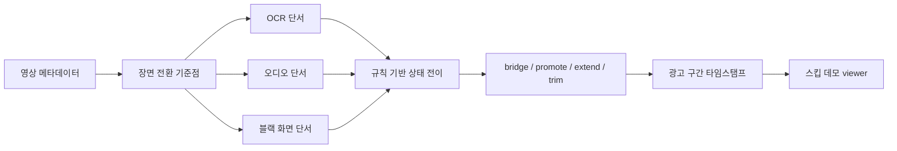

# YouTube Ad Segment Detector

유튜브 영상 안에 삽입된 광고 구간의 시작과 종료 시점을 추정하는 컴퓨터비전 프로젝트입니다. 장면 전환 기준점(scene anchor)을 먼저 찾고, 그 주변의 OCR 단서와 오디오 단서, 블랙 화면 단서를 함께 해석해 광고 구간 타임스탬프를 만듭니다. 무거운 모델을 사용해 광고인지 아닌지 판단하는 방식이 아닌, 규칙 기반으로 광고 시작과 종료 경계를 찾는 데 초점을 두었습니다.

**역할**: 데이터 파이프라인 설계 및 멀티모달 상태 전이(State Machine) 탐지 규칙 구현
**핵심 기술**: OpenCV, FFmpeg, TransNetV2, OCR, Rule-based State Machine

---

## 1. Business Question
*"영상 내부에 직접 삽입된 광고 구간을 식별할 수 있을까?"*

유튜브 영상의 내부 광고 장면 전환 기준점과 주변의 텍스트, 오디오 단서를 종합하여 실제 스킵 서비스에 적용 가능한 수준의 타임스탬프를 도출하는 것을 목표로 합니다.

RestNet을 이용해 광고 구간의 시각적 특징을 학습하는 기존 방식은 광고 구간의 시각적 특징을 학습하는 데에 어려움이 있었습니다.
따라서 규칙 기반으로 유튜브 영상 속 시각 정보 등을 활용하여 전환형 광고를 식별하고 이를 스킵하는 서비스 구현하는 것을 목표로 했습니다.

## 2. Data Overview & Policy
유튜브 영상의 저작권 준수를 위해, 스키마와 UI 구조 설명용 샘플만 공개합니다. 전체 재현을 위해서는 private/local video data와 feature table이 필요합니다.

**데이터 수집**: 실제 유튜브 영상을 자체 수집하여 분석 진행

*원시 영상 파일에서 3가지 피처를 독립적으로 추출하여 단서로 활용했습니다.*

- 화면 전환 후보: openCV·FFmpeg, ResNet, TransNetV2 등의 3가지 방식을 결합해 영상에서의 장면 전환 후보를 추출했습니다.
- OCR: 추출된 주요 프레임에 EasyOCR을 적용하여, 텍스트 데이터로 변환했습니다.
- 오디오: 영상의 오디오 트랙을 분리하여 특정 구간에서의 데시벨 변화나 무음 구간 등 오디오 레벨의 변동 흐름을 수치화했습니다.

## 3. Architecture



- OpenCV/FFmpeg, ResNet embedding, TransNetV2는 광고 분류기가 아니라 장면 전환 후보를 찾는 방식으로 사용했습니다.
- OCR은 유료광고 고지, 협찬 표현, 제품명, 구매 유도 문구, 링크 안내 같은 광고성 텍스트 단서를 제공합니다.
- 오디오는 같은 영상 안에서 평소보다 소리가 활발해지거나 조용해지는 흐름을 보조 단서로 사용합니다.
- 상태 전이 규칙은 `non_ad`, `start_pending`, `in_ad`, `end_pending` 상태를 이동하며 후보 구간을 만듭니다.
- 정답 구간은 탐지 과정에 넣지 않고, 결과 평가와 오류 분석에만 사용합니다.

## 저장소 구성

| 경로 | 내용 |
| --- | --- |
| `scripts/` | 장면 전환, OCR, 오디오, 융합, 탐지기, review viewer 관련 구현 |
| `src/` | split 용어 정리 등 공용 helper |
| `configs/` | 탐지 규칙과 feature 추출 설정 |
| `docs/` | 파이프라인, 데이터 정책, 규칙 설계, 오류 분석, 재현 방법 |
| `data/sample/` | 스키마 확인용 샘플 CSV/JSON |
| `results/` | 공개용 성능 요약 CSV |
| `assets/demo_screenshots/` | 원본 영상 프레임을 쓰지 않는 demo 설명 이미지 |
| `outputs/demo/final_presentation_ad_skip_viewer/` | 실제 영상 없이 타임라인 구조를 보여주는 샘플 viewer |

## 4. Tech Stack
Data Pipeline & Multi-modal Extraction (데이터 추출)

1. 멀티모달 데이터 파이프라인 설계
단일 데이터에 의존하지 않고, 원본 영상에서 세 가지 독립적인 피처(Feature)를 추출하여 분석 기반을 마련했습니다.
영상/오디오 분할 및 전처리: FFmpeg와 OpenCV를 활용하여 원본 영상을 초 단위 프레임으로 분할하고, 오디오 트랙을 분리해 메타데이터 파싱 환경을 구축했습니다.
장면 전환 후보 추출: 단순 이미지 분류를 넘어 프레임 간의 맥락 변화를 포착하기 위해, PyTorch 기반의 TransNetV2와 ResNet Embedding을 적용하여 의미 있는 장면 전환 시점을 비전 피처로 추출했습니다.
광고성 텍스트(OCR) 확보: 주요 프레임에 EasyOCR을 적용해 유튜브 영상의 화면 자막을 광고 구간 주요 단서로 활용하기 위해 텍스트 피처로 변환했습니다.

2. 상태 전이 기반 알고리즘 구현 (Rule-based State Machine)
복잡한 모델 사용 없이, 규칙 기반을 이용한 광고 탐지 파이프라인을 구축했습니다.
단일 타임라인 융합: 앞서 추출한 장면 전환 후보, OCR, 오디오 피처를 동일한 시간축 위에 하나의 통합 데이터로 병합했습니다.
설명 가능한 경계 추정 (State Machine): non_ad, start_pending, in_ad, end_pending 상태를 순차적으로 이동하는 규칙 기반 알고리즘을 설계했습니다. 이를 통해 특정 구간이 왜 광고로 판별되었는지 추적하고, 최종 스킵 경계를 초 단위로 정밀하게 보정했습니다.

## 5. Trade-off 판단 기록

| 상황 | 대안 | 선택기준 | 결정 | 결과 | 
| --- | --- | --- | --- | --- |
| openCV를 이용한 화면 전환 후보 추출시 일부 영상에 대한 추출 실패 발생 | openCV와 FFmpeg을 같이 사용 | 모든 영상에 대한 안정적인 추출 가능성 | openCV로 추출 실패한 영상에 대해서 FFmpeg 사용 | 모든 영상에 대한 화면 전환 후보 추출에 성공했습니다. |
|  |  |  |  |  |
|  |  |  |  |  |
|  |  |  |  |  |
|  |  |  |  |  |

## 6. Troubleshooting (STAR)

예측 광고 구간 끊김 문제 해결
Situation (상황): 예측 광고 구간이 짧게 끊어지는 현상이 발생해 실제 광고 구간을 덮지 않음.
Task (과제): [그래서 무엇을 해결하거나 검증해야 했는지 작성]
Action (행동): [어떤 분석 과정, 가설, 도구를 사용해 조치했는지 작성]
Result (결과): [Development Set 포착률 상승 수치, 양호 판정 구간 개수 등 구체적인 결과와 배운 점 작성]

## 데모 확인

```bash
cd youtube-ad-segment-detector-github
python scripts/review/serve_final_presentation_ad_skip_viewer.py --host 127.0.0.1 --port 8000
```

브라우저에서 `http://localhost:8000`을 열면 샘플 광고 구간 타임라인과 지표 패널을 볼 수 있습니다. 이 저장소에는 원본 영상이 포함되어 있지 않으므로 영상 재생 대신 구조 확인용 경고가 표시됩니다.

demo viewer의 manifest와 metrics는 UI 구조를 설명하기 위한 공개 샘플입니다. 실제 영상 프레임을 쓰지 않는 구조 예시는 [assets/demo_screenshots/demo_viewer_overview.svg](assets/demo_screenshots/demo_viewer_overview.svg)에 있습니다.

## 결과 요약

아래 지표는 제공된 최종 평가 요약값이며, 영상별 결과를 평균해 정리한 값입니다. 공개용 문서에서는 세부 내부 분할명을 줄이고 `Development Set`과 `Test Set` 중심으로 설명합니다.

| 지표 | 값 | 의미 |
| --- | ---: | --- |
| 광고 구간 포착률(Recall) | 85.0% | 각 영상에서 실제 광고 구간을 얼마나 덮었는지 평균 |
| 예측 광고 정밀도(Precision) | 67.8% | 각 영상에서 광고라고 예측한 구간이 실제 광고와 얼마나 겹쳤는지 평균 |
| 평균 시작 오차 | 38.4초 | 실제 광고 시작 시점과 가장 잘 맞는 예측 구간 시작 시점의 평균 차이 |
| 평균 종료 오차 | 43.4초 | 실제 광고 종료 시점과 가장 잘 맞는 예측 구간 종료 시점의 평균 차이 |
| 비광고 오탐 시간 | 55.8초 | 영상 하나당 평균적으로 비광고를 광고로 잘못 잡은 시간 |

이 결과는 광고 구간을 놓치지 않는 방향을 우선한 설정에서 정리한 값입니다. 광고 구간 포착률은 85.0%였지만, 예측 광고 정밀도는 67.8%로 일부 비광고 구간이 광고 예측에 포함되었습니다. 평균 시작·종료 오차도 수십 초 단위로 남아 있어, 정확한 경계 정밀화는 추가 개선이 필요합니다.

CSV 형식의 공개용 성능 요약은 [results/final_metrics_summary.csv](results/final_metrics_summary.csv)에 정리했습니다. 식별자를 제거한 영상별 지표 예시는 [results/metrics_by_video_anonymized.csv](results/metrics_by_video_anonymized.csv)에 있습니다.

### Development Set 진단 기록

아래 수치는 포함된 샘플 데이터로 재계산한 값이 아니라, 원본 실험의 Development Set 사후 진단 기록입니다.

| 항목 | 값 | 의미 |
| --- | ---: | --- |
| 최종 예측 구간 수 | 13 | 후처리 적용 후 남은 탐지 결과 |
| 양호 판정 구간 | 9 | Development Set 진단 기준 |
| 종료가 짧은 구간 | 3 | 광고 시작은 잡았지만 종료 보정이 필요한 경우 |
| 후보는 있으나 선택되지 않은 구간 | 3 | review 후보가 final로 승격되지 않은 경우 |
| 오탐 후보 수 | 0 | Development Set 사후 진단 기준 |
| 과확장 구간 | 1 | 실제 광고보다 길게 잡힌 경우 |
| viewer 검토 대상 | 7 | 사람이 경계를 확인해야 하는 잔여 케이스 |

장면 전환 기준점 조합은 Development Set 광고 경계 기준으로 포착률@5초 0.875, 포착률@10초 0.969로 기록되었습니다.

## 데이터 공개 범위

저작권과 개인정보, 재현 가능한 실험 분리를 위해 다음 항목은 포함하지 않았습니다.

- 원본 YouTube 영상, 프레임 덤프, 오디오 덤프, proxy media
- private label CSV, OCR 원문 결과, 사람이 검토한 review output
- EasyOCR, PyTorch, TransNetV2 model cache 또는 weight
- 실행 로그, backup, generated report, notebook output
- 외부 논문 PDF, 외부 repository 복사본

샘플 CSV, demo manifest, demo metrics는 스키마와 UI 구조 설명용 예시입니다. 전체 재현에는 사용자가 직접 준비한 private/local video data와 feature table이 필요합니다.

## 한계

- Development Set 중심으로 규칙을 조정했으므로, Test Set 기준의 별도 holdout 평가가 필요합니다.
- 협찬/제품명만으로 광고성을 판단하기 어려운 구간은 보수적인 review 절차가 필요합니다.
- 실제 서비스형 스킵 기능으로 쓰려면 viewer 기반 경계 확인과 타임스탬프 freeze가 필요합니다.

자세한 내용은 `docs/model_pipeline.md`, `docs/rule_design.md`, `docs/data_policy.md`, `docs/error_analysis.md`, `docs/reproducibility.md`에 정리했습니다.
