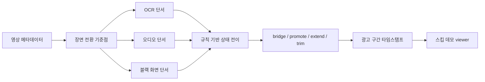

# YouTube Ad Segment Detector

유튜브 영상 안에 삽입된 광고 구간의 시작과 종료 시점을 추정하는 컴퓨터비전 프로젝트입니다. 장면 전환 기준점(scene anchor)을 먼저 찾고, 그 주변의 OCR 단서와 오디오 단서, 블랙 화면 단서를 함께 해석해 광고 구간 타임스탬프를 만듭니다.

단일 광고 분류 모델로 5초 단위 구간을 맞히는 방식보다, 실제 스킵에 필요한 `start_sec`, `end_sec` 경계를 설명 가능하게 찾는 데 초점을 두었습니다.

## 파이프라인



- OpenCV/FFmpeg, ResNet embedding, TransNetV2는 광고 분류기가 아니라 장면 전환 후보를 찾는 방식으로 사용했습니다.
- OCR은 유료광고 고지, 협찬 표현, 제품명, 구매 유도 문구, 링크 안내 같은 광고성 텍스트 단서를 제공합니다.
- 오디오는 같은 영상 안에서 평소보다 소리가 활발해지거나 조용해지는 흐름을 보조 단서로 사용합니다.
- 상태 전이 규칙은 `non_ad`, `start_pending`, `in_ad`, `end_pending` 상태를 이동하며 후보 구간을 만듭니다.
- 정답 구간은 탐지 과정에 넣지 않고, 결과 평가와 오류 분석에만 사용합니다.

## 저장소 구성

| 경로 | 내용 |
| --- | --- |
| `scripts/` | 장면 전환, OCR, 오디오, 융합, 탐지기, review viewer 관련 구현 |
| `src/` | split 용어 정리 등 공용 helper |
| `configs/` | 탐지 규칙과 feature 추출 설정 |
| `docs/` | 파이프라인, 데이터 정책, 규칙 설계, 오류 분석, 재현 방법 |
| `data/sample/` | 스키마 확인용 샘플 CSV/JSON |
| `results/` | 공개용 성능 요약 CSV |
| `assets/demo_screenshots/` | 원본 영상 프레임을 쓰지 않는 demo 설명 이미지 |
| `outputs/demo/final_presentation_ad_skip_viewer/` | 실제 영상 없이 타임라인 구조를 보여주는 샘플 viewer |

## 데모 확인

```bash
cd youtube-ad-segment-detector-github
python scripts/review/serve_final_presentation_ad_skip_viewer.py --host 127.0.0.1 --port 8000
```

브라우저에서 `http://localhost:8000`을 열면 샘플 광고 구간 타임라인과 지표 패널을 볼 수 있습니다. 이 저장소에는 원본 영상이 포함되어 있지 않으므로 영상 재생 대신 구조 확인용 경고가 표시됩니다.

demo viewer의 manifest와 metrics는 UI 구조를 설명하기 위한 공개 샘플입니다. 실제 영상 프레임을 쓰지 않는 구조 예시는 [assets/demo_screenshots/demo_viewer_overview.svg](assets/demo_screenshots/demo_viewer_overview.svg)에 있습니다.

## 결과 요약

아래 지표는 제공된 최종 평가 요약값이며, 영상별 결과를 평균해 정리한 값입니다. 공개용 문서에서는 세부 내부 분할명을 줄이고 `Development Set`과 `Test Set` 중심으로 설명합니다.

| 지표 | 값 | 의미 |
| --- | ---: | --- |
| 광고 구간 포착률(Recall) | 85.0% | 각 영상에서 실제 광고 구간을 얼마나 덮었는지 평균 |
| 예측 광고 정밀도(Precision) | 67.8% | 각 영상에서 광고라고 예측한 구간이 실제 광고와 얼마나 겹쳤는지 평균 |
| 평균 시작 오차 | 38.4초 | 실제 광고 시작 시점과 가장 잘 맞는 예측 구간 시작 시점의 평균 차이 |
| 평균 종료 오차 | 43.4초 | 실제 광고 종료 시점과 가장 잘 맞는 예측 구간 종료 시점의 평균 차이 |
| 비광고 오탐 시간 | 55.8초 | 영상 하나당 평균적으로 비광고를 광고로 잘못 잡은 시간 |

이 결과는 광고 구간을 놓치지 않는 방향을 우선한 설정에서 정리한 값입니다. 광고 구간 포착률은 85.0%였지만, 예측 광고 정밀도는 67.8%로 일부 비광고 구간이 광고 예측에 포함되었습니다. 평균 시작·종료 오차도 수십 초 단위로 남아 있어, 정확한 경계 정밀화는 추가 개선이 필요합니다.

CSV 형식의 공개용 성능 요약은 [results/final_metrics_summary.csv](results/final_metrics_summary.csv)에 정리했습니다. 식별자를 제거한 영상별 지표 예시는 [results/metrics_by_video_anonymized.csv](results/metrics_by_video_anonymized.csv)에 있습니다.

### Development Set 진단 기록

아래 수치는 포함된 샘플 데이터로 재계산한 값이 아니라, 원본 실험의 Development Set 사후 진단 기록입니다.

| 항목 | 값 | 의미 |
| --- | ---: | --- |
| 최종 예측 구간 수 | 13 | 후처리 적용 후 남은 탐지 결과 |
| 양호 판정 구간 | 9 | Development Set 진단 기준 |
| 종료가 짧은 구간 | 3 | 광고 시작은 잡았지만 종료 보정이 필요한 경우 |
| 후보는 있으나 선택되지 않은 구간 | 3 | review 후보가 final로 승격되지 않은 경우 |
| 오탐 후보 수 | 0 | Development Set 사후 진단 기준 |
| 과확장 구간 | 1 | 실제 광고보다 길게 잡힌 경우 |
| viewer 검토 대상 | 7 | 사람이 경계를 확인해야 하는 잔여 케이스 |

장면 전환 기준점 조합은 Development Set 광고 경계 기준으로 포착률@5초 0.875, 포착률@10초 0.969로 기록되었습니다.

## 데이터 공개 범위

저작권과 개인정보, 재현 가능한 실험 분리를 위해 다음 항목은 포함하지 않았습니다.

- 원본 YouTube 영상, 프레임 덤프, 오디오 덤프, proxy media
- private label CSV, OCR 원문 결과, 사람이 검토한 review output
- EasyOCR, PyTorch, TransNetV2 model cache 또는 weight
- 실행 로그, backup, generated report, notebook output
- 외부 논문 PDF, 외부 repository 복사본

샘플 CSV, demo manifest, demo metrics는 스키마와 UI 구조 설명용 예시입니다. 전체 재현에는 사용자가 직접 준비한 private/local video data와 feature table이 필요합니다.

## 한계

- Development Set 중심으로 규칙을 조정했으므로, Test Set 기준의 별도 holdout 평가가 필요합니다.
- 협찬/제품명만으로 광고성을 판단하기 어려운 구간은 보수적인 review 절차가 필요합니다.
- 실제 서비스형 스킵 기능으로 쓰려면 viewer 기반 경계 확인과 타임스탬프 freeze가 필요합니다.

자세한 내용은 `docs/model_pipeline.md`, `docs/rule_design.md`, `docs/data_policy.md`, `docs/error_analysis.md`, `docs/reproducibility.md`에 정리했습니다.
